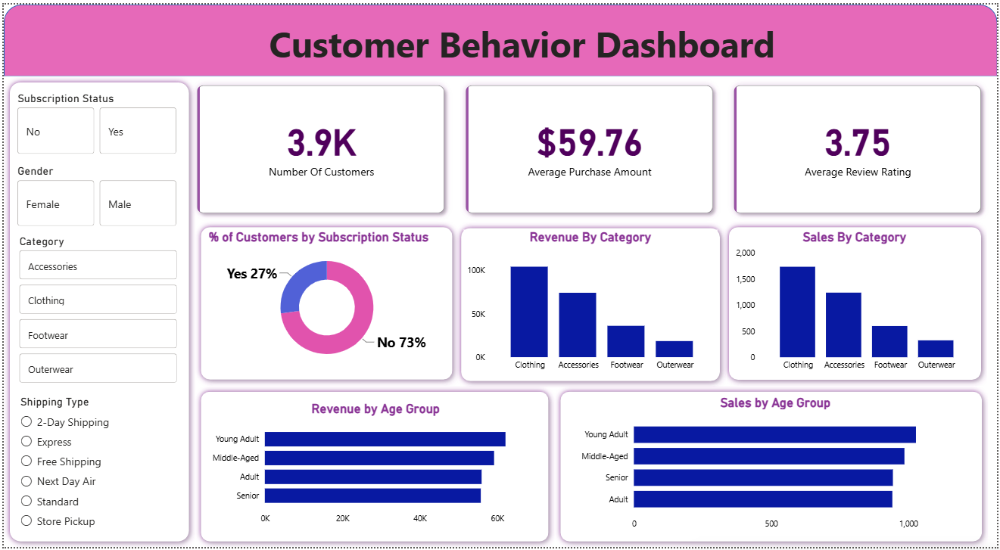

# 🛍️ Customer Shopping Behavior Analysis

> End-to-end data analytics project analyzing 3,900 retail transactions to uncover insights into customer segments, revenue trends, and discount behavior.

---

## 📌 Overview

This project follows the complete data analyst workflow — from raw data to business recommendations. The goal was to analyze customer shopping patterns and answer key business questions to guide strategic decisions around subscriptions, discounts, product positioning, and targeted marketing.

---

## 📂 Dataset

| Property | Detail |
|---|---|
| Rows | 3,900 |
| Columns | 18 |
| Source | Retail transactional dataset |
| Missing Data | 37 null values in Review Rating column |

**Key Features:**
- Customer demographics — Age, Gender, Location, Subscription Status
- Purchase details — Item, Category, Purchase Amount, Season, Size, Color
- Behavior signals — Discount Applied, Frequency of Purchases, Shipping Type, Review Rating, Previous Purchases

---

## 🛠️ Tools & Technologies

| Layer | Tools |
|---|---|
| Data Cleaning & EDA | Python (pandas, numpy), Jupyter Notebook |
| Database | PostgreSQL, pgAdmin |
| Business Analysis | SQL (CTEs, Window Functions, Aggregations, Subqueries) |
| Visualization | Power BI, DAX |
| Reporting | MS Word, Gamma (PPT) |

---

## 🔄 Project Steps

### 1. Data Cleaning (Python)
- Loaded dataset using `pandas` and explored structure via `df.info()` and `df.describe()`
- Imputed **37 missing Review Rating values** using category-wise median
- Renamed all columns to `snake_case` for consistency
- Engineered 2 new features: `age_group` (binned from Age) and `purchase_frequency_days`
- Verified that `discount_applied` and `promo_code_used` were redundant — dropped `promo_code_used`
- Exported cleaned DataFrame directly into PostgreSQL via Python

### 2. SQL Business Analysis (PostgreSQL)
Wrote 10 structured queries to answer real business questions:

| # | Question |
|---|---|
| 1 | Revenue by Gender |
| 2 | High-Spending Discount Users (above average spend) |
| 3 | Top 5 Products by Average Review Rating |
| 4 | Shipping Type Comparison (Standard vs Express) |
| 5 | Subscribers vs Non-Subscribers (spend & revenue) |
| 6 | Discount-Dependent Products (top 5 by discount rate) |
| 7 | Customer Segmentation (New / Returning / Loyal) |
| 8 | Top 3 Products per Category (Window Function) |
| 9 | Repeat Buyers & Subscription Correlation |
| 10 | Revenue by Age Group |

### 3. Power BI Dashboard
- Connected Power BI directly to PostgreSQL
- Built 3 DAX measures: `Number of Customers`, `Average Purchase Amount`, `Average Review Rating`
- Designed slicers for Subscription Status, Gender, Category, and Shipping Type
- Created visuals: KPI cards, donut chart, bar charts by category and age group

### 4. Report & Presentation
- Compiled findings into a structured project report
- Built a presentation using **Gamma** summarizing the pipeline, insights, and recommendations

---

## 📊 Dashboard Preview



> Interactive dashboard with filters for Gender, Category, Subscription Status, and Shipping Type.

**KPIs tracked:**
- 📦 Total Customers: **3,900**
- 💰 Average Purchase Amount: **$59.76**
- ⭐ Average Review Rating: **3.75 / 5**

## 📈 Key Results

- **Clothing dominates** — drives 44.7% of total revenue ($104K out of $233K)
- **839 high-spend discount users** were identified spending above the dataset average — discount policy needs review
- **80% of repeat buyers (>5 purchases) are non-subscribers** — major retention gap
- **Express shipping users spend 3.5% more** than Standard ($60.48 vs $58.46) — higher-intent buyer segment
- **Young Adults** are the highest revenue age group at $62K, outpacing Seniors by ~11%
- Customer base is **73% non-subscribers** — large untapped audience for subscription conversion

---

## 💡 Business Recommendations

1. **Boost Subscriptions** — Promote exclusive benefits to convert the 73% non-subscriber base
2. **Loyalty Programs** — Target the 701 Returning customers to move them into the Loyal segment
3. **Review Discount Policy** — High-spend discount users exist, but discounts aren't increasing basket size
4. **Product Positioning** — Prioritize Clothing and top-rated items (Gloves, Sandals, Boots) in campaigns
5. **Targeted Marketing** — Focus on Young Adults and Express shipping users as high-value segments

---

## ▶️ How to Run

### Prerequisites
- Python 3.8+
- PostgreSQL
- Power BI Desktop
- Libraries: `pandas`, `numpy`, `sqlalchemy`, `psycopg2`

### Steps

```bash
# 1. Clone the repository
git clone https://github.com/LegDaySkipper/customer_behavior_analysis.git
cd customer-shopping-behavior-analysis

# 2. Install dependencies
pip install pandas numpy sqlalchemy psycopg2-binary jupyter

# 3. Open and run the Jupyter notebook
jupyter notebook notebooks/analysis.ipynb
```

**For SQL Analysis:**
- Open `sql/queries.sql` in pgAdmin or any PostgreSQL client
- Run queries against the loaded table

**For Power BI Dashboard:**
- Open `dashboard/Customer_Behavior_Dashboard.pbix` in Power BI Desktop
- Update the PostgreSQL connection string to your local credentials

---

## 📁 Repository Structure

```
customer-shopping-behavior-analysis/
│
├── data/
│   └── customer_shopping_behavior.csv
│
├── notebooks/
│   └── analysis.ipynb          # Data cleaning & EDA
│
├── sql/
│   └── sql_queries.sql             # All 10 business queries
│
├── dashboard/
│   └── Dashboard.pbix
│
├── report/
│   └── Customer_Shopping_Behavior_Analysis.pdf
│
├── dashboard.png               # Dashboard screenshot
└── README.md
```
